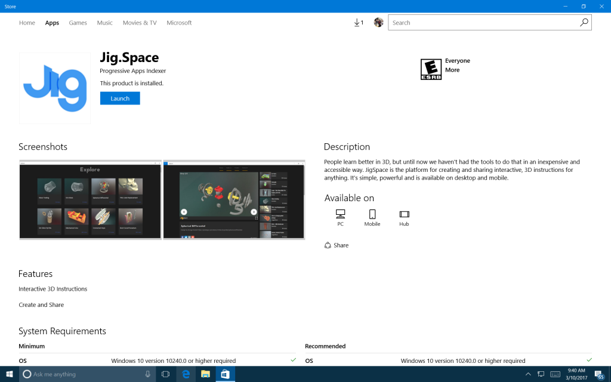
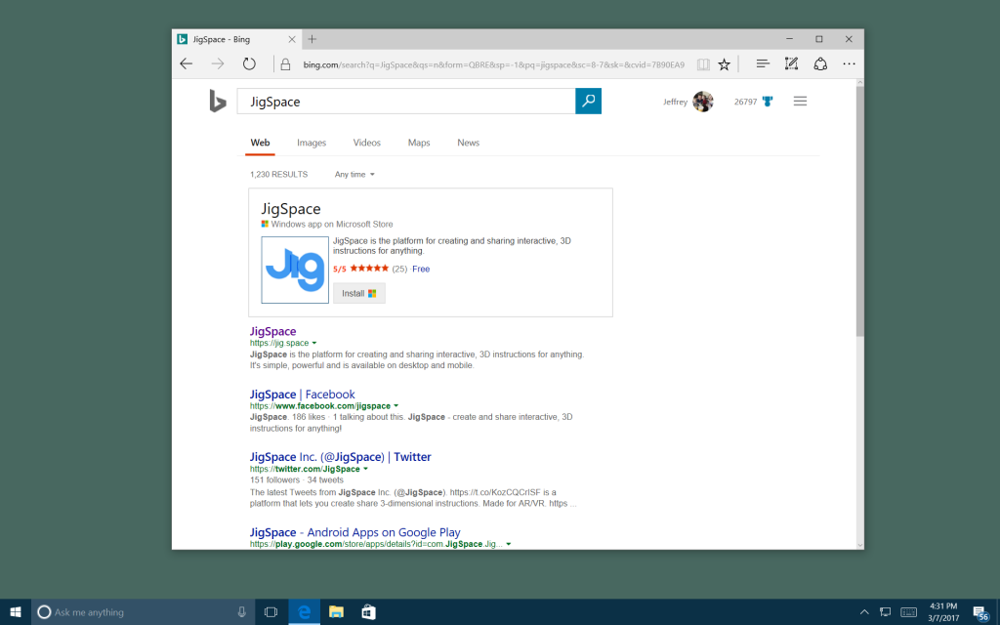
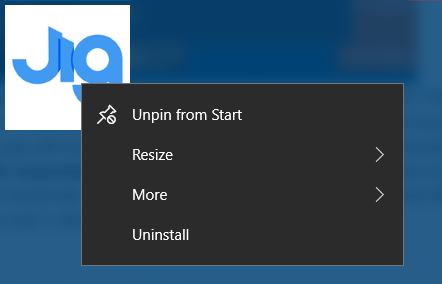
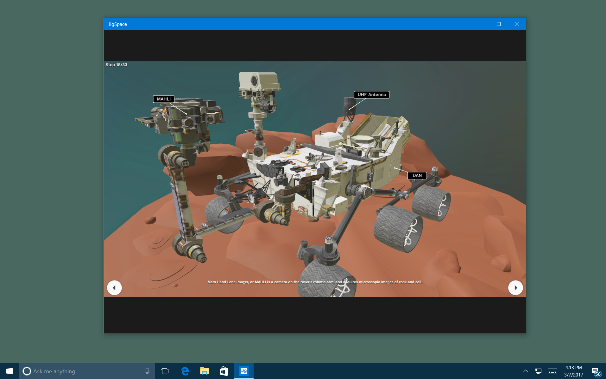

## Benefits of PWA on Windows 10

Hosted Web Apps have some key user experience and discoverability advantages over remaining in the browser. Depending on your app’s customers and scenarios, you should review this list of benefits and determine whether your app is best delivered in the browser, as a hosted web app, or both.

### Easier app management

As previously mentioned, a few weeks ago Microsoft announced a new version of Intune directed towards EDU to help teachers and schools better manager devices. By moving your web app to a HWA/PWA, it allows teachers and administrators to prep students devices with your app along side of the other store apps they use.

### User notifications

You may already be using web notifications for re-engaging your users. These notifications will appear in the action center, where users are accustomed to find them. With a small amount of code added to your app, you can send push notifications or use the notification gateway to send toast notifications or Tile updates even when your app isn’t running.

### Store listing

Hosted Web Apps get a listing in the Windows Store just like any application. When a user goes to the Windows Store to find education apps, your app will appear alongside the others and will participate in other store discovery mechanisms such as “recommended apps”.

> Hosted Web Apps (and, in the future, Progressive Web Apps) can be listed in the Windows 10 Store for better discoverability and manageability.

The store also provides you with additional benefits such as usage reports and performance data. You also receive ratings and reviews, which gives you a way to get feedback from your users, and respond to that feedback in ways we just don’t have on the web today.

### More surfaces for discovery

In Windows 10 HWA/PWAs will appear wherever users expect to find apps. This includes discoverability in areas like “related apps” in the store, Cortana search, the start menu and even installs from within the bing.com search listing.

> Web apps listed in the Windows Store are featured in related Bing search results

### Integration with the host operating system

HWA / PWA appear to a user as any other app. This means that a user and easily install and uninstall the apps. It means that the web app will be integrated into the settings panel (for example, with notifications).

> Web apps are managed just like native apps, including all the relevant contextual controls and management options.

These apps work as stand-alone apps, so they have their own tile, their own task bar menus and even appear as apps within the task manager.

### Access to expanded resources

When your web app runs as a HWA / PWA is has more access to resource. This means data caps on storage like IndexedDB and local storage are removed. It also means your app will have a dedicated cache that will never be deprioritized by another app.

> [JigSpace](https://jig.space/) provides interactive guidance for complex objects like this “jig” of the mars rover.

### API access for expanded functionality

HWA / PWA apps have access to the [Windows Store App APIs](https://docs.microsoft.com/en-us/uwp/api/) through JavaScript. This allows you to take advantage of features like BTLE, USB access or access to the user’s calendar or contacts with appropriate permission controls.